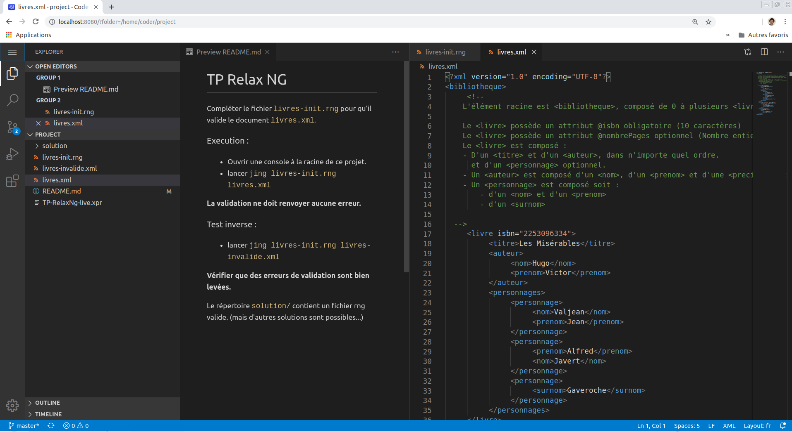

# Env Docker - TP RelaxNG

Environnement pédagogique web - [TP sur le langage de grammaire XML RelaxNG](https://relaxng.org/)

Basé sur [codercom/code-server](https://github.com/cdr/code-server), il expose un éditeur [VSCode](https://code.visualstudio.com/) online, accessible depuis un navigateur web.  
Les [fichiers sources du TP](https://github.com/jimetevenard/TP-RelaxNg.git) et son environnement d'exécution (Java + [Jing](https://github.com/relaxng/jing-trang)) sont préinstallés.

## Lancement et utilisation

Cette image est publiée automatiquement sur le dépôt central [Docker Hub](https://hub.docker.com/r/jimetevenard/code-env/tags) à chaque *commit* sur la branche *master* de ce *repo*. (cf [workflow Github](.github/workflows/docker-image.yml))

````
# Pull de l'image depuis Docker Hub (facultatif, sera fait lors du run à défaut)
docker pull jimetevenard/code-env:relaxng

# lancement d'un container et exposition du port 8080 en local
docker run -d -p 127.0.0.1:8080:8080 jimetevenard/code-env:relaxng --auth none
````

### Accès depuis un navigateur

Accéder ensuite à <http://localhost:8080/?folder=/home/coder/project>  
L'éditeur s'ouvre alors sur le projet du TP !



### Test de l'environnement du TP

L'utilitaire *Jing* est disponible dans le *path* du container.

Exemple : [ouvrir le terminal intégré à VSCode](https://code.visualstudio.com/docs/editor/integrated-terminal) et taper la commande suivante :

````
# Valider avec Jing le fichier livres.xml avec le schéma livres-init.xml
jing livres-init.rng livres.xml
````

### Notes

* le fait de spécifier l'hôte local dans le mapping de port `-p 127.0.0.1:8080:8080` restreint l'exposition du serveur à la machine hôte.

  * On aurait pu exploser ce port `8080` à l'exterieur de l'hôte (si celui-ci est accessible depuis Internet ou un réseau) avec simplement `-p 8080:8080`.
  * Cela n'est toutefois pas recommandé, on préferera utiliser un *reverse proxy* (avec chiffrement TLS pour servir en HTTPS) pour exposer notre container. L'usage d'un serveur en *reverse proxy* permet également de mapper un (sous-)domaine différent pour chacun des conteneurs.  
  * Code-server est néanmois capable de gérer lui-même les certificats TLS. (voir § Liste des *args* de *code-server*)

* On spécifie l'option `--auth none` pour désactiver l'authentification par mot de passe de code-server (de façon à générer nous même l'authentification)

* Il peut être utile de faire un *volume* sur le répertoire du projet (pour le conserver à l'extérieur du container : `-v "/somwhere/on/host:/home/coder/project"`

## Build en local du Dockerfile

Pour tester une modification en local du Dockerfile ou des sources, vous pouvez builder vous-même l'image :

````
# build de l'image de ce dépot
docker build -t code-env:relaxng .
````

## Annexe : Liste complète des *args* de *code-server*

Peut être obtenu avec `docker exec <CONTAINER_ID> code-server --help`.

Reproduit à titre indicatif ci-dessous :

````
jim@jim-VirtualBox:~$ docker exec focused_keller code-server --help
code-server 3.0.0

Usage: code-server [options] [path]

Options
      --auth                The type of authentication to use. [password, none]
      --cert                Path to certificate. Generated if no path is provided.
      --cert-key            Path to certificate key when using non-generated cert.
      --disable-updates     Disable automatic updates.
      --disable-telemetry   Disable telemetry.
      --host                Host for the HTTP server.
   -h --help                Show this output.
      --open                Open in browser on startup. Does not work remotely.
      --port                Port for the HTTP server.
      --socket              Path to a socket (host and port will be ignored).
   -v --version             Display version information.
      --user-data-dir       Path to the user data directory.
      --extensions-dir      Path to the extensions directory.
      --list-extensions     List installed VS Code extensions.
      --force               Avoid prompts when installing VS Code extensions.
      --install-extension   Install or update a VS Code extension by id or vsix.
      --uninstall-extension Uninstall a VS Code extension by id.
      --show-versions       Show VS Code extension versions.
 -vvv --verbose             Enable verbose logging.
````

