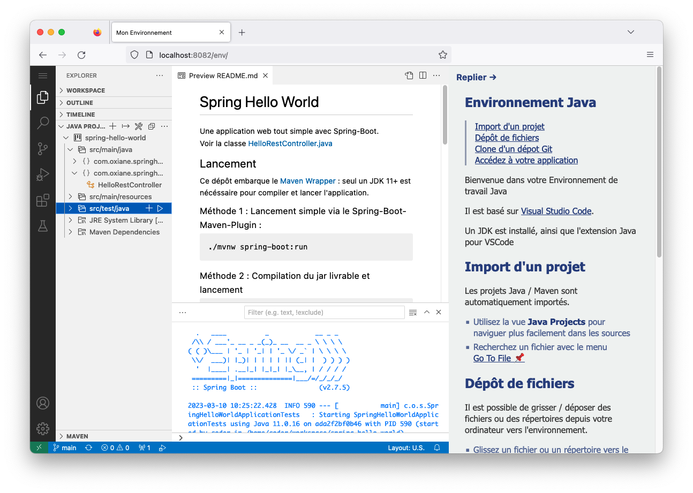

# Env Docker - Java

Environnement pédagogique web - Java

Basé sur [codercom/code-server](https://github.com/cdr/code-server), il expose un éditeur [VSCode](https://code.visualstudio.com/) online, accessible depuis un navigateur web.  

Un dépôt Git peut être cloné au lancement du *container* : son URL doit être fournie via la variable d'environnement `GIT_REPOSITORY`

Aucune *authentication* n'est actuellement gérée : le repository doit être plublic.  
Si aucune URL n'est fournie, le repository [Spring Hello World](https://github.com/jimetevenard/spring-hello-world) sera clonné.

