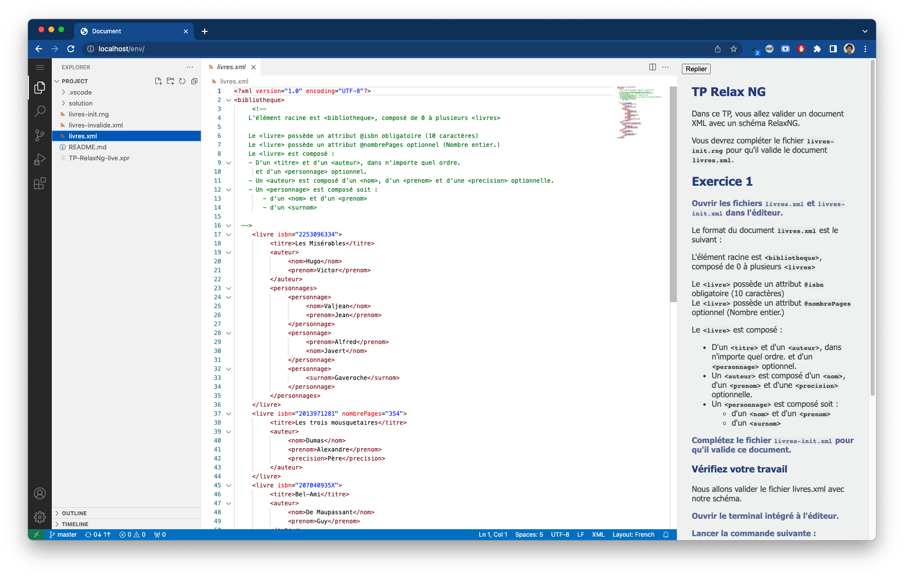

# Env Docker - TP RelaxNG

Environnement pédagogique web - [TP sur le langage de grammaire XML RelaxNG](https://relaxng.org/)

Les [fichiers sources du TP](https://github.com/jimetevenard/TP-RelaxNg.git) et son environnement d'exécution (Java + [Jing](https://github.com/relaxng/jing-trang)) sont préinstallés.

## Lancement et utilisation

Cette image est publiée automatiquement sur le dépôt central [Docker Hub](https://hub.docker.com/r/jimetevenard/code-env/tags) à chaque *commit* sur la branche *master* de ce *repo*. (cf [workflow Github](.github/workflows/docker-image.yml))

````
# Pull de l'image depuis Docker Hub (facultatif, sera fait lors du run à défaut)
docker pull jimetevenard/code-env:xml-relaxng

# lancement d'un container et exposition du port 80 en local
docker run -d -p 127.0.0.1:80:80 jimetevenard/code-env:xml-relaxng
````

### Accès depuis un navigateur

Accéder ensuite à <http://localhost/>  

L'éditeur s'ouvre alors sur le projet du TP !  
La consigne du TP est affichée à droite de l'application.




### Test de l'environnement du TP

L'utilitaire *Jing* est disponible dans le *path* du container.

Exemple : [ouvrir le terminal intégré à VSCode](https://code.visualstudio.com/docs/editor/integrated-terminal) et taper la commande suivante :

````
# Valider avec Jing le fichier livres.xml avec le schéma livres-init.xml
jing livres-init.rng livres.xml
````